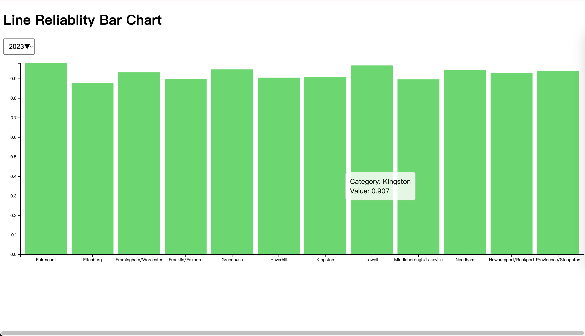

# MBTA Rider Diagnostics Dashboard

## Acknowledgements

This project utilized the third-party libraries [jQuery](https://jquery.com/) and the [d3](https://d3js.org/) visualization library

### Branches
The other branches also contain our other visulation:
+ [bar_chart](https://github.com/Ajax12345/cr_project/tree/bar_chart): Line Reliablity Bar Chart
+ [pie_chart](https://github.com/Ajax12345/cr_project/tree/pie_chart)

## Bar Chart to Show delay situation

In this branch, it includes one line reliablity bar chart. The user can change the year to see all reliablity data for every lines in tooltip.